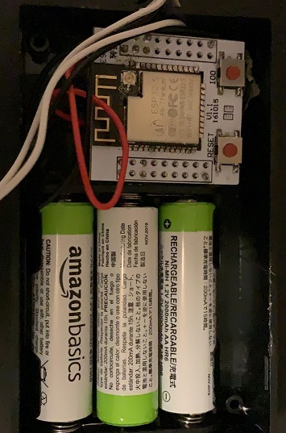
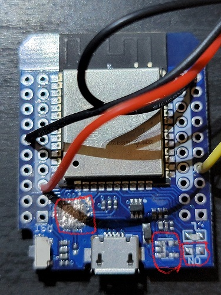
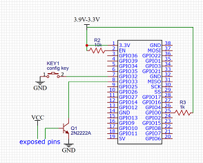
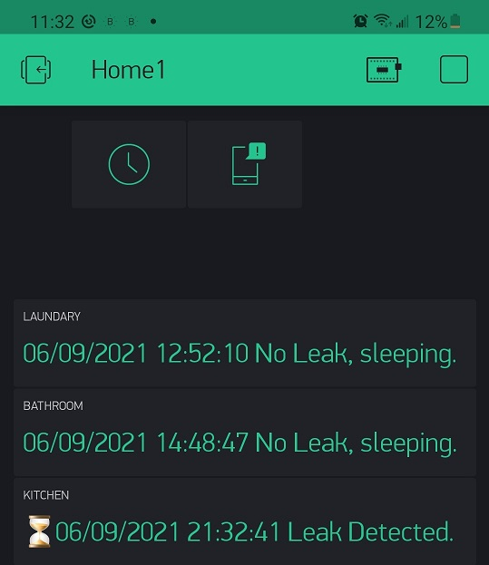
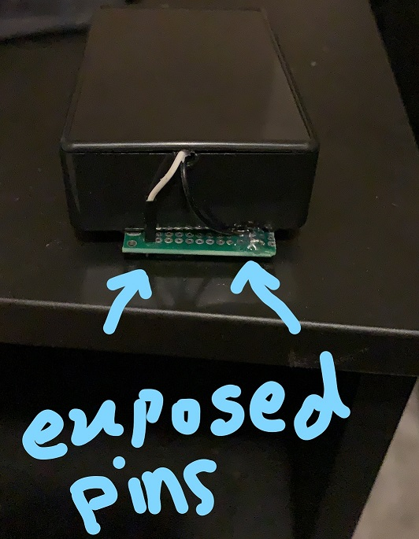

ESP32 IOT wifi leak detector

This IOT project is a simple wifi leak detector based on Blynk platform. If a water leak is detected in the house for example, it sends a message on the phone via Blynk app. The leak is detected when water reaches the exposed pins (see schematics.png in the docs folder). The board will also wake up every 12 hours to send health message to the Blynk app, it just says no leak is detected and updates the time.

Hardware: 
ESP32 Bare chip, to achieve a few micro amp power consumption in deep sleep mode and save battery, you may use a bare ESP32 chip instead of the development boards available in the market. Most dev boards available online use power regulator and they consume milli amps in deep sleep and drain the battery. I tried a  ESP32 breakout boards to use Bare ESP32 chip.

D1 Mini ESP-32 is another choice of board, you may flash the board using the usb cable first, then remove the usb chip from the board, remove power led and the power regulator to achieve a few micro amp power consumption (6 ua in my experiment). Please see the D1 Mini ESP32 image below in which usb chip, power led, and power regulator has been removed.
https://www.aliexpress.com/item/4000232057013.html?spm=a2g0s.9042311.0.0.50464c4dLTajfl

Schematics:
for a bare ESP32 chip, GPIO 0 and EN pins are pulled up with 10k resistor, GPIO 32 can be grounded for config purpose, and GPIO 33 is grounded when water touches the exposed pins. Grounding GPIO 33 wakes up the board and sends a leak alert to the Blynk app on the phone
D1 Mini ESP32 has already the pullup resistors, so no need to do anything

Software:
VSCode + PlatformIO extension can be used to compile and upload this firmware to the board. Blynk App needs to be installed on phone, with Display widgets and RTC widget. Make sure to change the COM port in platform.ini when flashing the board using VSCode

Initialize and run the kit:
On the phone, install the legacy Blynk App (the new one is not tested yet), add a ESP32 device (and save the auth code), add a display widget on Virtual port V1, with a refresh rate of 8 hours. 
With the board, power the circuit with 3.3 to 3.8V (won’t work if higher or lower), ground the GPIO32 pin which activates the config mode, on your PC search for LEAKDETECTORxxx wireless access point, and connect to it, In your browser, goto http://192.168.4.1, enter your Blynk auth code and access point credentials, and fill the Blynk info (server blynk-cloud.com, port 80 or 8080 in case of local blynk server). Unground GPIO32, reset the board and it should connect to your Blynk App on phone.

Test:
Put the exposed pin on a wet surface and it should wake up and send alert to your phone

Power supply: use a 18650 battery, but make sure the charge voltage is not higher than 3.9 volts.

Update Dec 2021:
Blynk legacy cloud platform may shut down in favor of the new blynk iot platform. Hence I setup my own blynk server on a raspberry pi. Authentication of Blynk has been updated recently, so I had to use an older version of blynk local server. On top of that the most recent android blynk app doesn't let you create new user!!!, so I had to install older version from APK file. At the end these are the versions I could match:

Blynk local server:
https://github.com/blynkkk/blynk-server/releases/tag/v0.41.15

Blynk XAPK android app: v 2.7.31:
https://m.apkpure.com/blynk-legacy/cc.blynk/variant/2.27.31-XAPK#variants

@note use local server on port 8080 for provisioning.

@note when adding a new ESP32 device, regenerate authentication tokens until one is generated without underscore (_) character, sounds like blynk has problem with it

@note Firebeetle ESP32 board has a 11 ua power consumption in sleep mode, which is great for this project. To use this board enable USE_FIREBEETLE_ESP32 in the main.cpp. Remember for this board port 27 is for config and port 15 is for leak detection.